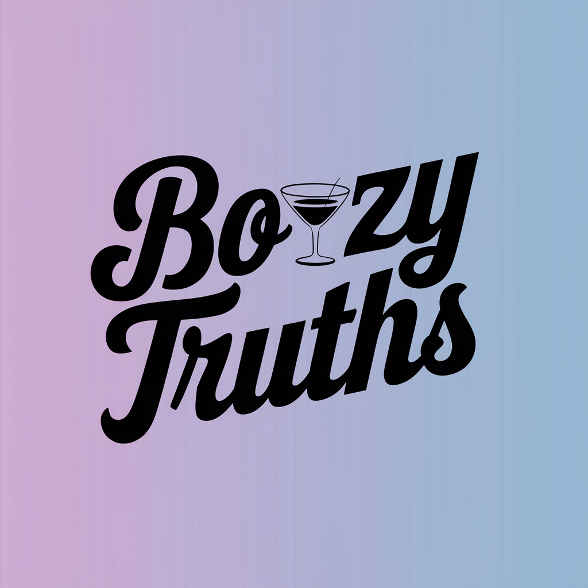

# Boozy Truth

An interactive avatar-based drinking game and truth-telling experience.

## Getting Started

1. Clone this repo
2. Navigate to the repo folder in your terminal
3. Run `npm install`
4. Enter your HeyGen Enterprise API Token or Trial Token in the `.env` file
5. Run `npm run dev` to start the development server
6. Open [http://localhost:3000](http://localhost:3000) in your browser

## Features

- Interactive avatars for engaging conversations
- Voice and text chat modes
- Beautiful UI with dark/light mode support
- Responsive design for all devices

## License

MIT License - See [LICENSE](LICENSE) for details
