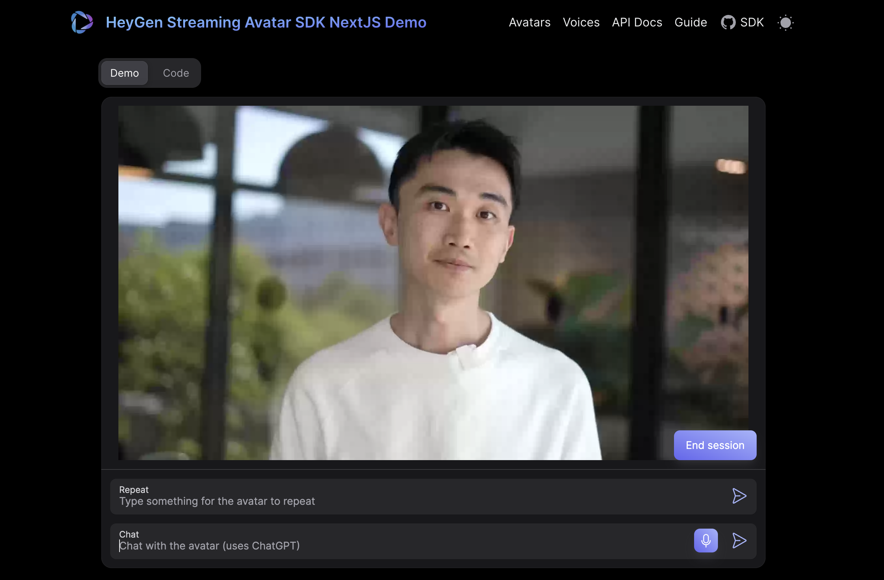

# HeyGen Interactive Avatar NextJS Demo

This is a sample project and was bootstrapped using [NextJS](https://nextjs.org/).
Feel free to play around with the existing code and please leave any feedback for the SDK [here](https://github.com/HeyGen-Official/StreamingAvatarSDK/discussions).

## Getting Started FAQ

### Setting up the demo

1. Clone this repo

2. Navigate to the repo folder in your terminal

3. Run `npm install` (assuming you have npm installed. If not, please follow these instructions: https://docs.npmjs.com/downloading-and-installing-node-js-and-npm/)

4. Enter your HeyGen Enterprise API Token in the `.env` file. Replace `HEYGEN_API_KEY` with your API key. This will allow the Client app to generate secure Access Tokens with which to create interactive sessions.

   You can retrieve either the API Key by logging in to HeyGen and navigating to this page in your settings: [https://app.heygen.com/settings?from=&nav=Subscriptions%20%26%20API]. 

5. (Optional) If you would like to use the OpenAI features, enter your OpenAI Api Key in the `.env` file.

6. Run `npm run dev`

### Starting sessions

NOTE: Make sure you have enter your token into the `.env` file and run `npm run dev`.

To start your 'session' with a Interactive Avatar, first click the 'start' button. If your HeyGen API key is entered into the Server's .env file, then you should see our demo Interactive Avatar appear.

If you want to see a different Avatar or try a different voice, you can close the session and enter the IDs and then 'start' the session again. Please see below for information on where to retrieve different Avatar and voice IDs that you can use.

### Which Avatars can I use with this project?

By default, there are several Public Avatars that can be used in Interactive Avatar. (AKA Interactive Avatars.) You can find the Avatar IDs for these Public Avatars by navigating to [labs.heygen.com/interactive-avatar](https://labs.heygen.com/interactive-avatar) and clicking 'Select Avatar' and copying the avatar id.

You can create your own custom Interactive Avatars at labs.heygen.com/interactive-avatar by clicking 'create interactive avatar' on the top-left of the screen.

### Where can I read more about enterprise-level usage of the Interactive Avatar API?

Please read our Interactive Avatar 101 article for more information on pricing: https://help.heygen.com/en/articles/9182113-interactive-avatar-101-your-ultimate-guide
